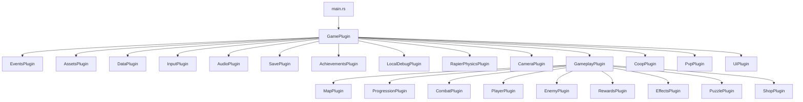
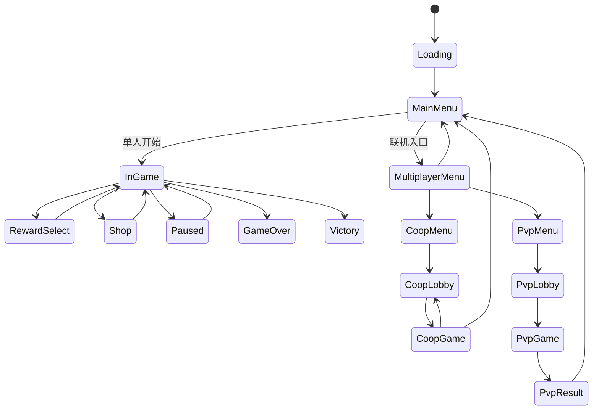
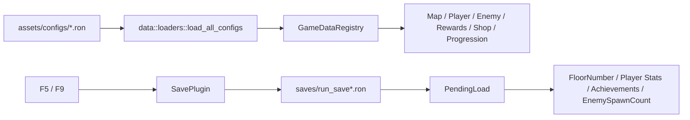

# 架构总览

- 适用版本：当前工作树（HEAD `aa90cf3c`，tag `saved-version-20260330-161713`）
- 最后校验：2026-03-31；`cargo check` 通过，`cargo test` 24 项通过
- 关联源码：`src/main.rs`、`src/app.rs`、`src/states.rs`、`src/core/`、`src/data/`、`src/gameplay/`、`src/coop/`、`src/pvp/`、`src/ui/`
- 实验性内容：包含。单机骨架稳定，联机部分仍为原型架构

## 1. 总体设计思路
项目采用 Bevy ECS + 插件化装配。整体思路不是把“单机”“Coop”“PVP”拆成三个完全独立程序，而是在同一套应用里：

- 用 `AppState` 管理场景级流程
- 用 `GamePlugin` 聚合所有子系统
- 用 `GameDataRegistry` 提供统一配置源
- 用 `gameplay/` 提供单机和联机共用的玩法骨架
- 用 `coop/` 和 `pvp/` 分别承载两套网络实现
- 用 `ui/` 统一管理菜单、HUD、暂停、奖励、结算

核心原则：

1. 游戏流程统一由状态管理驱动。
2. 玩法规则尽可能与表现层解耦。
3. 联机不强行复用同一套网络栈，而是允许 `Coop` 和 `PVP` 用不同实现。
4. 配置、存档、成就等横切能力通过 `core/` 与 `data/` 提供。

## 2. 顶层装配
`src/main.rs` 只负责创建 `App`、设置窗口和注册 `GamePlugin`。真正的系统拼装发生在 `src/app.rs`。

## 3. 状态机
### 3.1 全局状态 `AppState`
项目把单机、多人大厅、联机对局、奖励页、商店页、暂停页和结算页全部纳入一个统一状态机。

### 3.2 房间状态 `RoomState`
`RoomState` 是单局内部推进状态，不等同于 `AppState`：

- `Idle`：可进入、可交互、未锁门
- `Locked`：战斗房或解谜房正在进行
- `Cleared`：当前房间目标已完成，可离开
- `BossFight`：Boss 特化阶段

## 4. ECS 分层
项目在代码结构上大致形成了五层：

| 层级 | 责任 | 典型目录 |
| --- | --- | --- |
| 启动/装配层 | App 创建、插件挂载、状态初始化 | `src/main.rs`、`src/app.rs`、`src/states.rs` |
| 基础设施层 | 资源、输入、事件、音频、相机、存档、成就、本地联调 | `src/core/` |
| 数据定义层 | 配置结构、加载器、全局注册表 | `src/data/` |
| 玩法域层 | 地图、玩家、战斗、敌人、奖励、商店、解谜、成长、共享规则 | `src/gameplay/` |
| 网络与表现层 | Coop/PVP 网络运行时、菜单、HUD、叠层 UI、通知 | `src/coop/`、`src/pvp/`、`src/ui/` |

### 4.1 共享玩法与联机边界
单机与联机不是两套完全分裂的玩法逻辑。`gameplay/` 下很多系统在 `CoopGame` 中仍会被复用，但通常只在以下条件下运行：

- `in_state(AppState::CoopGame)`
- `is_coop_authority`
- `is_coop_simulation_active`

这意味着：

- 单机：本地世界直接推进
- Coop：Host 继续复用大量 gameplay 系统做权威模拟
- Client：更多是输入上传、复制态展示和联机 UI

`PuzzlePlugin` 是一个例外，它当前只挂在 `AppState::InGame`，因此在 Coop 中被视为未完全并入的原型能力。

## 5. 配置流与存档流

### 5.1 配置加载
- `DataPlugin` 在 `Loading` 状态下调用 `load_all_configs`
- 目标是生成单一资源 `GameDataRegistry`
- 若读取失败，会回退到 `default_registry()` 的默认值

### 5.2 存档加载
- `SavePlugin` 始终监听 `F5` / `F9`
- `F5` 直接序列化存档
- `F9` 先读入 `PendingLoad`
- 真正应用发生在 `AppState::InGame`

## 6. 单机、Coop、PVP 三条主线
### 6.1 单机
- `menu::menu_button_system` 切入 `InGame`
- `MapPlugin` 负责生成楼层与房间
- `PlayerPlugin`、`CombatPlugin`、`EnemyPlugin` 推进战斗循环
- `RewardsPlugin`、`ShopPlugin`、`ProgressionPlugin` 推进成长与结算

### 6.2 Coop
- `CoopLightyearPlugin` 负责 Lightyear 网络配置、组件注册、输入与消息收发
- `CoopRuntimePlugin` 负责 Host 权威模拟、阶段推进、房门、奖励、商店、RPS、会话控制
- `coop/ui.rs` 负责大厅、叠层 UI、复制体可视化、联机 HUD

设计重点：

- Host 同进程同时跑 server + local client
- Client 不直接主导玩法，只上传输入并渲染复制结果
- `CoopSessionState` 是联机阶段 UI 的核心同步对象

### 6.3 PVP
- `pvp/net.rs` 提供简化 UDP 协议
- `pvp/systems.rs` 推进对战模拟、本地预测、状态应用、HUD 更新
- `pvp/ui.rs` 管理大厅、结果页和输入

设计重点：

- PVP 明确与 Coop 分离，没有复用 Lightyear
- 这降低了简单对战场景的接入成本，但也导致多人功能存在两套技术路径

## 7. 设计上的关键取舍
### 7.1 为什么 `GamePlugin` 统一聚合
这样可以让所有全局资源、物理插件、配置插件和 UI 插件只存在一个稳定入口，便于维护启动路径。

### 7.2 为什么 `Coop` 和 `PVP` 保留两套网络实现
- Coop 需要房间推进、共享阶段、复制实体、主机权威和更复杂的同步语义
- PVP 只需要双人对战、少量状态同步、简单结果页
- 当前工程选择以“功能可达”为优先，而不是在课程阶段强行统一网络栈

### 7.3 为什么抽出 `session_core`
`gameplay/session_core/mod.rs` 把奖励、商店、房间通关后决策、死亡判定等规则抽成共享域模型，避免：

- 单机逻辑与 Coop 逻辑重复实现
- 奖励/商店曲线在多个模块中分叉
- 测试只能围绕具体 UI 或具体运行时写

## 8. 当前架构结论
- 单机主循环已经形成稳定骨架
- `GamePlugin + AppState + GameDataRegistry` 是最重要的三根主轴
- `gameplay/` 是核心玩法域，`Coop` 与 `PVP` 是不同的网络外壳
- 当前最大维护成本不在目录层面，而在少数大文件和双网络栈并存带来的认知负担

进一步拆解请继续阅读 [`03_module_design.md`](03_module_design.md)。
